<div class="header">
    
    <span >PlayListify</span>
</div>
<hr/>

<h1 class="title">EN-US - What is it?🤔</h1>
<p>
    🎶 <span class="tag">PlayListify</span> is a music application that serves as a music library for you to listen to some songs during your daily tasks.
</p>
<hr/>
<h1>Application Screens 🖥️(Desktop)</h1>
<h3>Home:</h3>
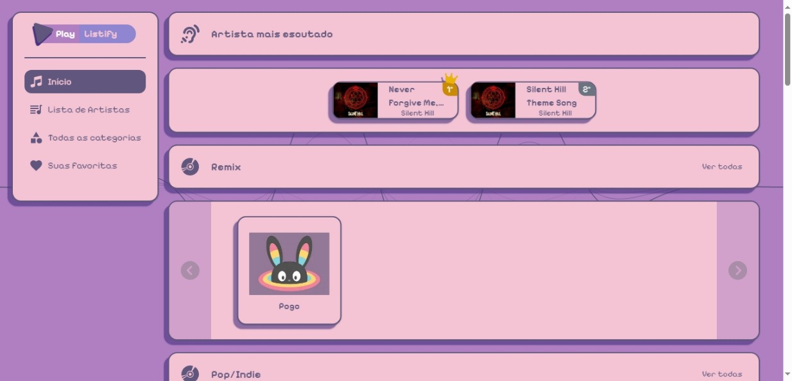
<h3>List of Artists:</h3>
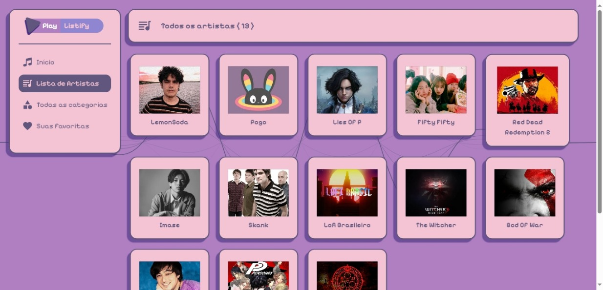
<h3>List of Artists by Category:</h3>
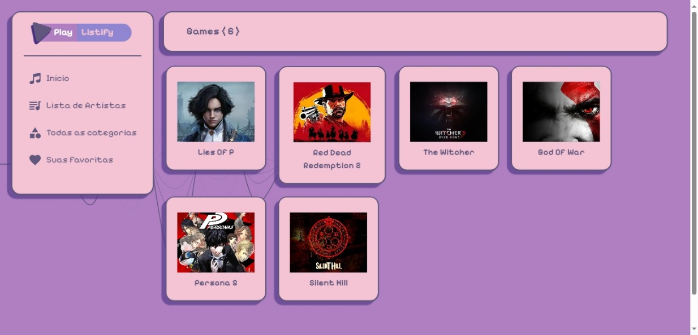
<h3>All Listed Categories:</h3>
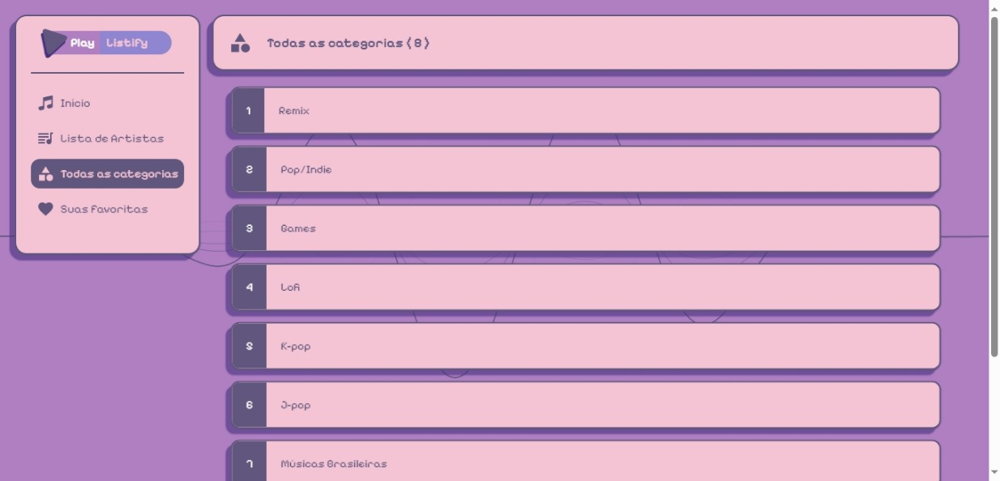
<h3>List of Songs Marked as Favorites:</h3>
<span>No songs selected</span>
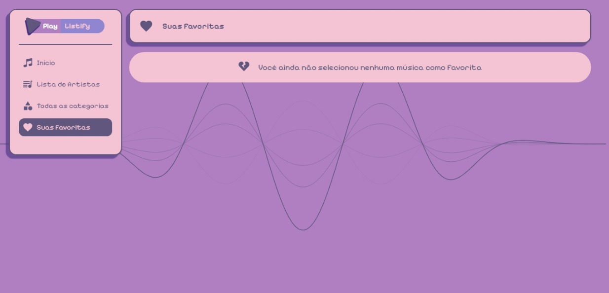
<span>With songs selected</span>
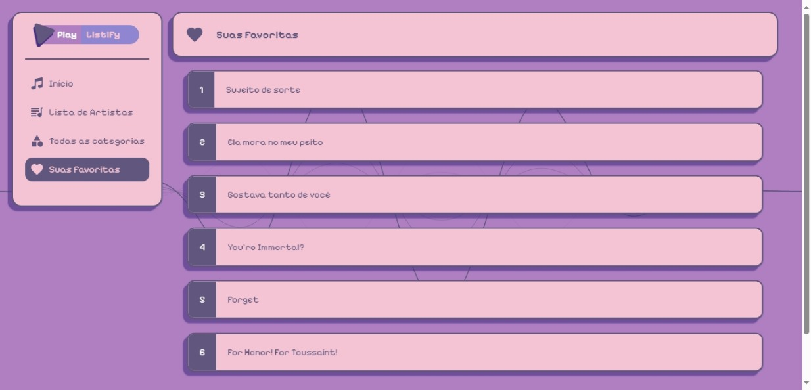
<hr/>
<h1>Application Screens 📱(Mobile)</h1>
<h3>Home:</h3>
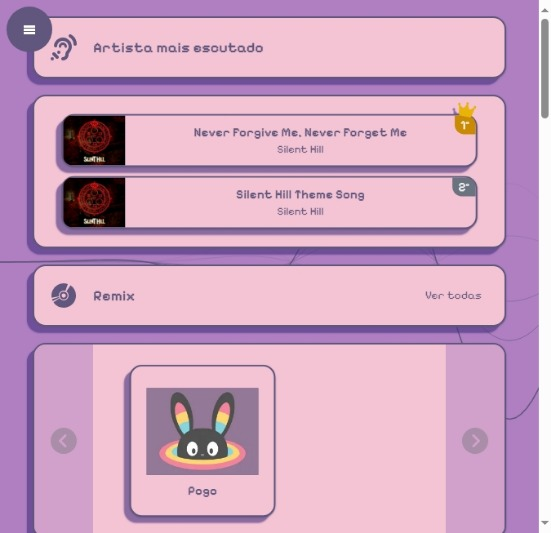
<h3>List of Artists:</h3>
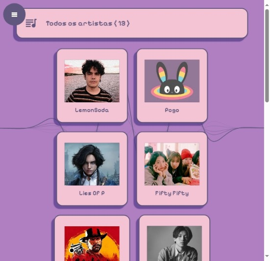
<h3>List of Artists by Category:</h3>
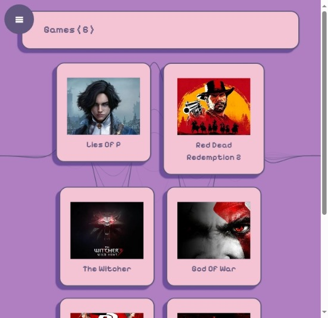
<h3>All Listed Categories:</h3>
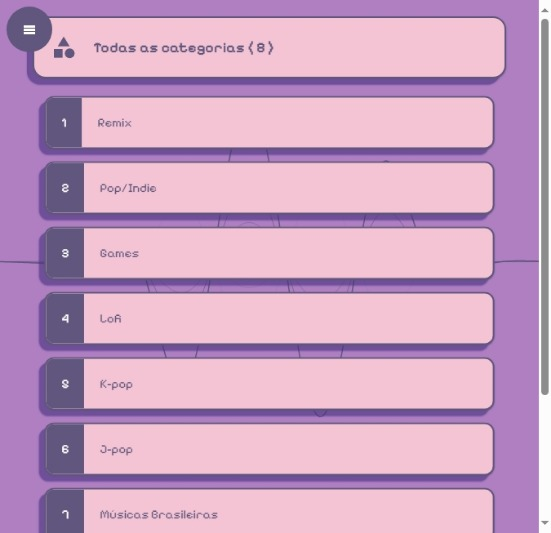
<h3>List of Songs Marked as Favorites:</h3>
<span>No songs selected</span>

<span>With songs selected</span>
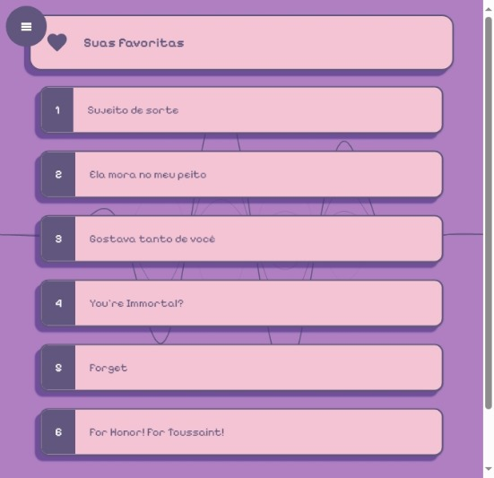
<hr/>

<section>
    <p>The project is for learning purposes only and is still in development.</p>
</section>

<hr/>
<hr/>
<hr/>
<hr/>
    
<h1 class="title">PT-BR - O que é?🤔 </h1>
<p>
    🎶 <span class="tag">PlayListify</span> É uma aplicação de músicas na qual consiste em ser um acervo musical apenas para que você possa ouvir algumas músicas durante as suas tarefas diárias. 
</p>
<hr/>
<h1>Telas da aplicação 🖥️(Desktop)</h1>
<h3>Home:</h3>

<h3>Lista de artistas:</h3>

<h3>Lista artistas por categoria:</h3>

<h3>Todas as categorias listadas:</h3>

<h3>Lista de músicas selecionadas como favoritas:</h3>
<span>Sem nenhuma música</span>

<span>Com músicas</span>

<hr/>
<h1>Telas da aplicação 📱(Mobile)</h1>
<h3>Home:</h3>

<h3>Lista de artistas:</h3>

<h3>Lista artistas por categoria:</h3>

<h3>Todas as categorias listadas:</h3>

<h3>Lista de músicas selecionadas como favoritas:</h3>
<span>Sem nenhuma música</span>

<span>Com músicas</span>

<hr/>

<section>
    <p>O projeto é apenas para fins de aprendizado e ainda está em desenvolvimento</p>
</section>

<hr/>
<hr/>
<hr/>
<hr/>
<hr/>
<hr/>
<hr/>
<hr/>
<hr/>
<hr/>
<hr/>
<hr/>
<hr/>

This is a [Next.js](https://nextjs.org/) project bootstrapped with [`create-next-app`](https://github.com/vercel/next.js/tree/canary/packages/create-next-app).

## Getting Started

First, run the development server:

```bash
npm run dev
# or
yarn dev
# or
pnpm dev
# or
bun dev
```

Open [http://localhost:3000](http://localhost:3000) with your browser to see the result.

You can start editing the page by modifying `app/page.js`. The page auto-updates as you edit the file.

This project uses [`next/font`](https://nextjs.org/docs/basic-features/font-optimization) to automatically optimize and load Inter, a custom Google Font.

## Learn More

To learn more about Next.js, take a look at the following resources:

- [Next.js Documentation](https://nextjs.org/docs) - learn about Next.js features and API.
- [Learn Next.js](https://nextjs.org/learn) - an interactive Next.js tutorial.

You can check out [the Next.js GitHub repository](https://github.com/vercel/next.js/) - your feedback and contributions are welcome!

## Deploy on Vercel

The easiest way to deploy your Next.js app is to use the [Vercel Platform](https://vercel.com/new?utm_medium=default-template&filter=next.js&utm_source=create-next-app&utm_campaign=create-next-app-readme) from the creators of Next.js.

Check out our [Next.js deployment documentation](https://nextjs.org/docs/deployment) for more details.
