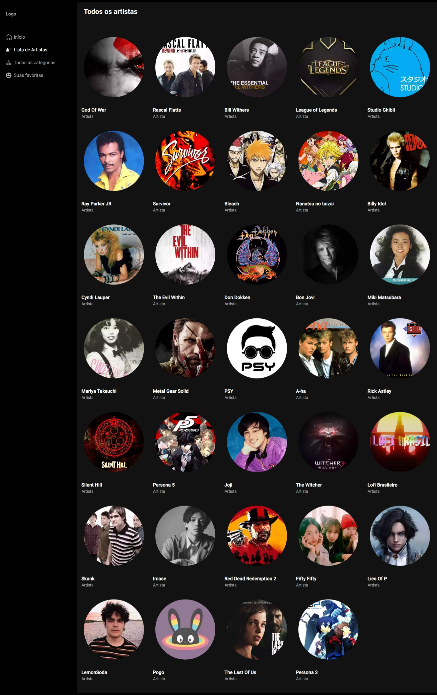

<h1>PlayListify</h1>

EN-US - What is it?🤔
=====================

🎶 PlayListify is a music application that serves as a music library for you to listen to some songs during your daily tasks.

* * *

Application Screens 🖥️(Desktop)
================================

### Home:


### List of Artists:



### List of Songs by Category:


### All Listed Categories:


### List of Songs Marked as Favorites:

No songs selected  With songs selected 

* * *

Application Screens 📱(Mobile)
==============================

### Home:


### List of Artists:


### List of Songs by Category:


### All Listed Categories:


* * *

The project is for learning purposes only and is still in development.

* * *

* * *

* * *

* * *

PT-BR - O que é?🤔
==================

🎶 PlayListify É uma aplicação de músicas na qual consiste em ser um acervo musical apenas para que você possa ouvir algumas músicas durante as suas tarefas diárias.

* * *

Telas da aplicação 🖥️(Desktop)
===============================

### Home:


### Lista de artistas:


### Lista de músicas da categoria escolhida:


### Todas as categorias:


### Lista de músicas selecionadas como favoritas:

Sem nenhuma música  Com músicas 

* * *

Telas da aplicação 📱(Mobile)
=============================


### Home:


### Lista de artistas:


### Lista de músicas da categoria escolhida:


### Todas as categorias:


* * *

O projeto é apenas para fins de aprendizado e ainda está em desenvolvimento

* * *
This is a [Next.js](https://nextjs.org/) project bootstrapped with [`create-next-app`](https://github.com/vercel/next.js/tree/canary/packages/create-next-app).

## Getting Started

First, run the development server:

```bash
npm run dev
# or
yarn dev
# or
pnpm dev
# or
bun dev
```

Open [http://localhost:3000](http://localhost:3000) with your browser to see the result.

You can start editing the page by modifying `app/page.js`. The page auto-updates as you edit the file.

This project uses [`next/font`](https://nextjs.org/docs/basic-features/font-optimization) to automatically optimize and load Inter, a custom Google Font.

## Learn More

To learn more about Next.js, take a look at the following resources:

- [Next.js Documentation](https://nextjs.org/docs) - learn about Next.js features and API.
- [Learn Next.js](https://nextjs.org/learn) - an interactive Next.js tutorial.

You can check out [the Next.js GitHub repository](https://github.com/vercel/next.js/) - your feedback and contributions are welcome!

## Deploy on Vercel

The easiest way to deploy your Next.js app is to use the [Vercel Platform](https://vercel.com/new?utm_medium=default-template&filter=next.js&utm_source=create-next-app&utm_campaign=create-next-app-readme) from the creators of Next.js.

Check out our [Next.js deployment documentation](https://nextjs.org/docs/deployment) for more details.
